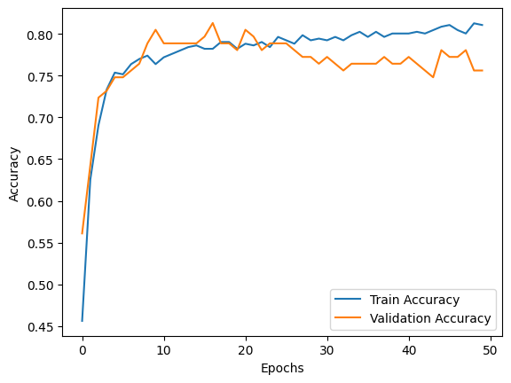
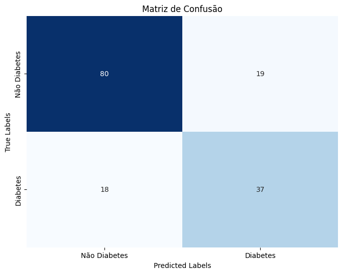

# Projeto de Análise e Modelagem de Diabetes Pima Indians

Este projeto tem como objetivo prever o início do diabetes usando o Pima Indians Diabetes Database. O modelo de previsão é construído usando uma Rede Neural implementada com a biblioteca Keras

## Dataset

O dataset utilizado é o [Pima Indians Diabetes Database](https://www.kaggle.com/datasets/uciml/pima-indians-diabetes-database) disponível no Kaggle. Ele contém 768 instâncias com 8 atributos de entrada e 1 atributo de saída:

- Pregnancies: Número de vezes grávida
- Glucose: Concentração de glicose plasmática 2 horas após um teste de tolerância à glicose oral
- BloodPressure: Pressão arterial diastólica (mm Hg)
- SkinThickness: Espessura da prega cutânea do tríceps (mm)
- Insulin: Insulina sérica em 2 horas (mu U/ml)
- BMI: Índice de massa corporal (peso em kg/(altura em m)^2)
- DiabetesPedigreeFunction: Função pedigree do diabetes
- Age: Idade (anos)
- Outcome: Variável de classe (0 ou 1)

## Objetivo

O objetivo deste projeto é desenvolver um modelo de aprendizado de máquina que possa prever se um paciente tem diabetes com base em medições diagnósticas. Usaremos uma Rede Neural para esse fim, aproveitando a biblioteca Keras para construir e treinar a rede neural.

## Pré-requisitos

Antes de começar, certifique-se de ter instalado o seguinte:

- Python (versão 3.6 ou superior)
- Bibliotecas Python:
  - Pandas
  - NumPy
  - Scikit-learn
  - TensorFlow
  - Keras
  - Matplotlib

Você pode instalar as dependências usando o arquivo `requirements.txt`:

```
pip install -r requirements.txt
```

## Estrutura do Projeto

A estrutura do projeto é organizada da seguinte forma:

```
project/
│
├── data/
│   └── diabetes.csv         # Dataset
│
│── img/
│    └──accuracy.png
│    └──loss.png
│    └──matriz_de_confusao.png
│
├── notebooks/
│   └── Diabetes_CNN_Keras.ipynb       # Notebook do projeto
│
├── README.md                # Documentação do projeto
│
├── requirements.txt         # Arquivo de dependências
```

- `data/`: Contém o dataset.
- `img/`: Contem as inmagens de plot da avalicao do modelo.
- `notebooks/`: Inclui notebooks Jupyter para exploração e visualização dos dados.

1. **Clone o repositório:**

   ```bash

   git clone https://github.com/henriquebap/Machine_Learning_HB/tree/main/Keras

   cd notebooks/Diabetes_Keras.ipynb
   ```

## Resultados

Após o treinamento do modelo, foram obtidas as seguintes métricas de desempenho no conjunto de testes:

#### Relatório de Classificação:
```
-------precision | recall | f1-score | support

    0       0.82       0.81        0.81         99
    1       0.66       0.67        0.67         55

    accuracy                                 0.76       154

macro avg 0.74 0.74 0.74 154
weighted avg 0.76 0.76 0.76 154
```

##### Acurracy:



##### Loss:




## Conclusões

Este repositório fornece exemplos práticos e detalhados de como implementar modelos de classificação e regressão usando a biblioteca Keras.

### Potenciais Melhorias e Extensões

- **Exploração de Arquiteturas Avançadas**:

  - Embora o foco principal esteja em redes neurais densas, futuras extensões penso em incluir arquiteturas mais avançadas, como Redes Neurais Convolucionais (CNNs) e Redes Neurais Recorrentes (RNNs), para lidar com dados de diferentes naturezas.

- **Aprimoramento de Feature Engineering**:

  - Implementar e avaliar técnicas avançadas de feature engineering talvez ofereca melhorias adicionais na performance dos modelos.

- **Validação Cruzada**:

  - A inclusão da validação cruzada no processo de treinamento podera fornecer uma estimativa mais robusta do desempenho do modelo e ajudar a evitar a seleção de modelos propensos ao overfitting.

## Referências

- Link para o dataset: [Pima Indians Diabetes Database](https://www.kaggle.com/datasets/uciml/pima-indians-diabetes-database)
- Documentação do Keras: [Keras API](https://keras.io/guides/functional_api/)

## Autor

#### Contato

- **LinkedIn** : [Henrique Baptista](https://www.linkedin.com/in/henrique-baptista777/)
- **GitHub** : [henriquebap](https://github.com/henriquebap)
- **Email** : [henriquebaptista2003@gmail.com](mailto:henriquebaptista2003@gmail.com)
